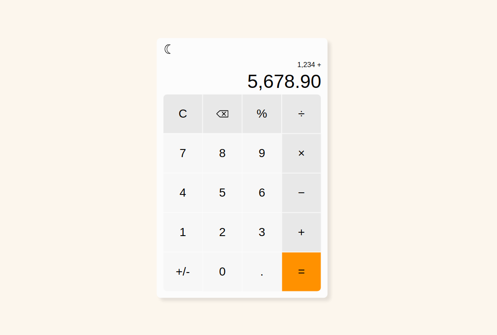

# Calculator

## Overview
This Calculator project was created as part of The Odin Project's curriculum to test everything that was learned in the foundations course. The project requirements can be found [here](https://www.theodinproject.com/lessons/foundations-calculator#assignment).

## Screenshot

## Features
I wanted to make this calculator function as closely as possible to the Windows calculator application in terms of how input was handled, formatted, and displayed. To achieve this, I incorporated the following functionality into the calculator:
* The previous operand entered and the operator selected are displayed above the current input
* The operator can be changed from its original selection so long as another operand hasn't been entered yet
* Any decimal point in the previous operand that was not followed by a digit was removed
* If a decimal point is entered without first entering a digit, a zero will be added before the decimal
* A 15-digit input limit was incorporated (not counting commas, decimal point, and/or negative sign)
* Any numbers longer than 18 digits were output after an operation, the number will be converted into exponential notation.
* If a number is divided by zero, a message stating, 'Cannot divide by zero' is displayed and all operator buttons along with the sign change and percentage button are disabled. Pressing the equals, backspace, or clear button will clear the screen back to 0 and enable all buttons again. Additionally, typing in another number will reset the display as well and display the new input.
* The previous operand entered will remain in the input field until another number is entered, or if another operator is selected before entering a new number, the operation will use the previous operand as the second operand.

Some additional features include:
* A clear button that will reset the display back to 0
* A backspace button that will remove one digit at a time of the current operand
* A percentage button that will either convert the current operand to its percentage equivalent (current operand divided by 100) if another operand hasn't been previously entered or it will change the current operand to the entered percentage of the previous operand.
* A sign change button that will change the current operand from positive to negative or from negative to positive
* A message will fade in/out when the 15-digit input limit is reached
* Keyboard support that will allow users to use their keyboard to input numbers and select operators. All buttons on the calculator are supported by keyboard input.

Furthermore, since it seems to be common to have dark theme/light theme toggle buttons on applications and websites these days, I wanted to incorporate this in this project as well. As such, a moon icon can be seen in the top-left-hand corner of the calculator display. Clicking the moon icon will display the calculator app in dark theme and the moon icon will become a sun icon. Clicking the sun icon will return the application back to light theme.

## What I Learned
I've learned many things throughout my time working on this project, including:
* How to create and use SVG icons:
    * Pros and cons of the various ways to add them to an HTML documents
    * How to optimize SVGs created in Inkscape
    * How to style SVGs via CSS
* How to utilize CSS variables to create light/dark themes
* How to add CSS transitions to gradually change from one style to the next
* How to use grid to layout the buttons in the calculator
* When to choose a switch statement over if/else
* How to add keyboard event listener and the usage of e.key and e.code
* How to use the OR operator in variable assignments to avoid unnecessary if/else statements

Above all else; however, I found the biggest lesson learned in this project is how important it is to have organized maintainable code. While The Odin Project curriculum hasn't covered much in the way of programming design at this point (appears to be a future topic), it would have been useful knowledge to have when tackling this project. 

There are many different features in this calculator and many different ways a user can interact with the application. My first attempt at this application quickly snowballed into an unmaintainable pile of spaghetti code littered with endless if/else statements. While the application worked, it became near impossible to continue adding new features due to how unmaintainable the code had become.

Rather than continue on this way, it seemed to be a better use of time to see how more seasoned programmers tackled this project and how they organized their code, so I studied a handful of different videos that covered how to develop this application. The most helpful video was from [Web Dev Simplified](https://www.youtube.com/watch?v=j59qQ7YWLxw&ab_channel=WebDevSimplified), who seemed to have the cleanest approach by breaking down everything into maintainable pieces.

I decided to refactor my own code using Web Dev Simplified's approach (although I used an object instead of a class) and used this as a foundation to build upon and add all the features I wanted to add to make the calculator function similarly to the Windows calculator application as detailed above in the features section.

By doing this, I learned how to better organize my functions, how to write early return statements, how to refactor my layout to use grid, and how to use fewer variables.

As I learn more throughout The Odin Project curriculum, I would like to revisit this project and see if I can refactor the code to be even cleaner.

## What I Used
* Git
* GitHub
* HTML / CSS
* JavaScript
* VSCode
* Inkscape (for creating SVG icons)

## Live Demo
[View Live Demo](https://creative-cookie.github.io/odin-calculator)